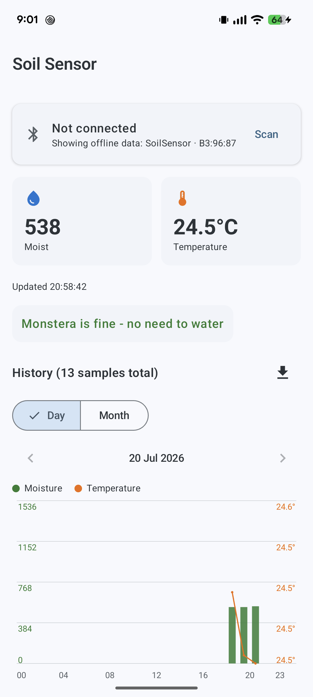

# Soil Sensor

A BLE soil moisture + temperature sensor for houseplants, built on a TI
CC2340R53 LaunchPad and an Adafruit STEMMA soil sensor, paired with an
Android app that logs and charts the history.

```
soil-sensor/
├── firmware/   TI SimpleLink BLE5-Stack firmware (FreeRTOS, ticlang)
├── android/    Kotlin/Compose companion app
└── docs/       screenshots etc.
```



## How it works

The LaunchPad reads the soil sensor over I2C every 10 minutes, keeps a
rolling buffer of recent samples, and advertises a custom BLE GATT service.
The Android app scans for that service, connects, pulls only the samples it
hasn't seen yet, and stores everything locally in a Room database so history
keeps accumulating for as long as you want (independent of the device's own
buffer size).

## Hardware

- **MCU**: TI LP-EM-CC2340R53 LaunchPad
- **Sensor**: [Adafruit STEMMA Soil Sensor](https://www.adafruit.com/product/4026) (seesaw firmware, I2C address `0x36`)
- **Wiring** (LaunchPad 40-pin BoosterPack header):
  - SDA → DIO0 (header pin 10)
  - SCL → DIO24 (header pin 9)
  - 3V3 → pin 1
  - GND → any GND pin

Pins were auto-assigned by SysConfig when the I2C module was added; if you
regenerate `freertos/soil_sensor.syscfg` from scratch, check
`ti_drivers_config.h` for `CONFIG_GPIO_I2C_0_SDA`/`_SCL` in case they move.

## Firmware

Location: `firmware/`. Based on the SimpleLink SDK's `basic_ble` example,
stripped down to a peripheral-only role (no central/observer/broadcaster/
OAD/pairing), plus:

- `app/soil_sensor.c` - I2C driver for the seesaw sensor
- `app/soil_history.c` - RAM ring buffer (1008 samples ≈ 7 days at 10-min
  cadence) with an ever-incrementing sequence number per sample, so a client
  can resume a sync instead of re-reading the whole buffer
- `app/Profiles/soil_sensor_profile.c` - custom GATT service
- `app/app_soil_sensor.c` - ties it together: a 10-minute `Clock` triggers a
  sample, which is stored and notified to any subscribed client

### Building

Requires the SimpleLink Lowpower F3 SDK, SysConfig, and the ticlang
compiler (all bundled with Code Composer Studio, or installable
standalone). Build from the command line:

```sh
cd firmware/freertos/ticlang
gmake \
  SYSCONFIG_TOOL=/path/to/sysconfig_cli.sh \
  TICLANG_ARMCOMPILER=/path/to/ti-cgt-armllvm_x.y.z.LTS
```

This produces `soil_sensor.out` and `soil_sensor.hex`. Flash either with
CCS/UniFlash, or import
`freertos/ticlang/soil_sensor_LP_EM_CC2340R53_freertos_ticlang.projectspec`
into CCS Theia to build/flash/debug from the IDE and edit the SysConfig file
visually.

The `SIMPLELINK_LOWPOWER_F3_SDK_INSTALL_DIR` default in the makefile is a
hardcoded absolute path - override it (or edit the makefile) if your SDK
lives somewhere else.

### Tuning

- **Sample interval**: `SOIL_SAMPLE_PERIOD_MS` in `app/app_soil_sensor.c`
  (currently 10 minutes).
- **Temperature calibration**: the seesaw's onboard temp sensor reads its
  own die temperature, which runs a few degrees above ambient from
  self-heating. `SOIL_TEMP_CALIBRATION_OFFSET_CENTIC` in `app/soil_sensor.c`
  (currently `-400`, i.e. -4.00°C) corrects for this - measure against a
  reference thermometer and adjust.
- **Moisture thresholds**: the raw capacitive value (~200 dry to ~2000
  submerged, per Adafruit's spec) isn't calibrated to any absolute moisture
  quantity and depends on your soil/pot. The Android app's dry/moist/wet
  buckets (`<300` / `300-999` / `≥1000`) are a rough starting point - use
  the CSV export to work out real thresholds for your plant.

## Android app

Location: `android/`. Kotlin + Jetpack Compose, Material 3 (dynamic color),
Room, no third-party BLE or charting libraries.

- `ble/SoilBleManager.kt` - scanning (filtered by service UUID, falls back
  to device name), GATT connect, and the incremental history sync protocol
- `data/` - Room database, per-device sync-state (SharedPreferences), CSV
  export
- `ui/` - Compose screens: connection card + device picker, current
  reading, watering advice, and a day/month chart (calendar-based paging,
  hourly/daily-averaged bars + temperature line, tap a bar for exact values)

### Building

```sh
cd android
./gradlew assembleDebug
adb install -r app/build/outputs/apk/debug/app-debug.apk
```

Requires `local.properties` pointing at an Android SDK (`sdk.dir=...`) -
not checked in, create your own. minSdk 31 (Android 12), targetSdk/compileSdk
37.

## BLE protocol

Custom 128-bit UUIDs on TI's base (`F000xxxx-0451-4000-B000-000000000000`):

| Characteristic      | UUID     | Type        | Description                                   |
|----------------------|----------|-------------|------------------------------------------------|
| Service              | `AA00`   | -           | Soil Sensor service                             |
| CURRENT_READING       | `AA01`   | notify/read | Latest sample, 8 bytes (see below)              |
| HISTORY_COUNT         | `AA02`   | read        | uint16, samples currently in the ring buffer    |
| HISTORY_INDEX         | `AA03`   | write       | uint16, index (oldest-first) to fetch next      |
| HISTORY_RECORD        | `AA04`   | read        | 8 bytes, the record at the last written index   |
| HISTORY_BASE_SEQ      | `AA05`   | read        | uint32, absolute sequence number of index 0     |

Record format (8 bytes, little-endian):
`{ uint32 uptimeSec; uint16 moistureRaw; int16 tempCentiC }`

`HISTORY_BASE_SEQ` + ring index gives each sample an absolute, never-reset
sequence number, which the phone persists per device to know where to
resume a sync from.

## Known limitations

- Temperature reading has a few degrees of inherent uncertainty (self-heating
  ATSAMD10 die sensor) - calibrate the offset for your setup.
- No BLE bonding/encryption - deliberately left unpaired since the GATT
  attributes don't require it; connecting shouldn't prompt for a PIN.
- Moisture thresholds are generic placeholders, not calibrated to a specific
  plant/soil - export CSV data and tune once you have enough history.
